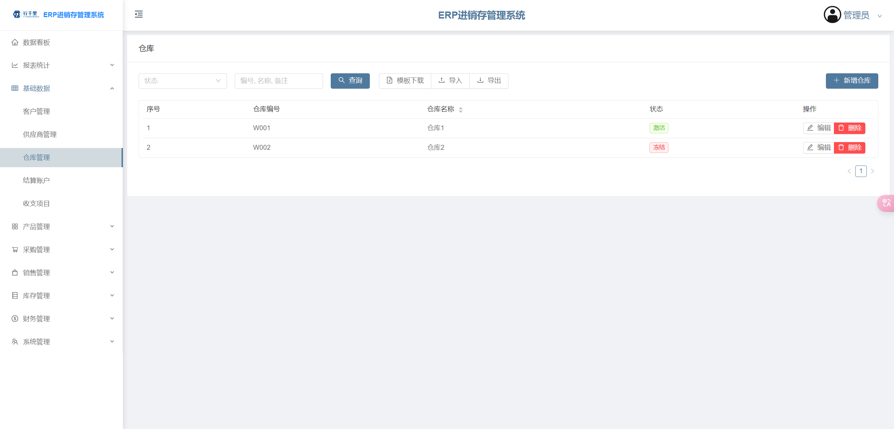

## ERP管理系统-代码运行说明
* 开源的ERP系统，使用django+vue搭建，目前demo搭建在[erp.tanfuhua.com](https://erp.tanfuhua.com)上
* 有产品管理、采购管理、生成管理、销售管理、财务管理、报表统计、系统管理板块，包含不同权限，覆盖绝大部分ERP的场景
* [erp.tanfuhua.com](https://erp.tanfuhua.com)（用户名：管理员，密码：123456）

## 开发环境要求
* Python版本为V3.9+ （推荐使用conda控制版本）
* Django版本为V3.2+
* nodejs 为 12.13.1（推荐使用nvm 控制版本）
* 数据库为MySQL 8.0+

## 快捷部署-docker

### 方法一 拉取代码后，本地build up
~~~
docker-compose up --build -d
~~~

### 方法二 拉取代码后，拉取build好的镜像，然后up
~~~
docker pull registry.cn-hangzhou.aliyuncs.com/tfh/erp-nginx
docker pull registry.cn-hangzhou.aliyuncs.com/tfh/erp-web
docker pull registry.cn-hangzhou.aliyuncs.com/tfh/erp-backend
docker tag registry.cn-hangzhou.aliyuncs.com/tfh/erp-nginx erp-nginx
docker tag registry.cn-hangzhou.aliyuncs.com/tfh/erp-web erp-web
docker tag registry.cn-hangzhou.aliyuncs.com/tfh/erp-backend erp-backend
docker-compose up -d
~~~
* 访问 127.0.0.1:8080查看效果
* 数据库防止和本地的数据库端口冲突，开放在3307端口
* 后端端口在8000上，使用nginx对该端口进行了代理转发

## 本地运行流程（不推荐）

### 前端（nodejs 为 12.13.1）

~~~
cd ./frontend
# 设置镜像
npm config set registry https://registry.npmmirror.com/
npm config set ignore-engines true
# 安装yarn
npm install -g yarn
# yarn安装依赖包
yarn install
# 在utils/config.js里设置自己的后端地址-baseUrl
# 前端 运行
yarn serve
~~~

#### 前端打包（部署的时候执行）
~~~
yarn build
~~~

### 后端运行(3.9+)
~~~
cd ./django
# 安装依赖包
pip install -i https://pypi.tuna.tsinghua.edu.cn/simple -r requirements.txt
# 运行
python manage.py runserver
~~~

#### 后端部署（部署的时候执行）
~~~
uwsgi --ini ./django/configs/uwsgi.ini
~~~

### 数据库设置

1. 数据库字符集设置为 utf8mb4
2. 创建 erp-db 数据库(先设置字符集, 再创建数据库)
    CREATE DATABASE erp_db;
3. ./django/configs/django.py里修改password,user,host，port（你的ip）字段
4. 迁移数据库
    * python manage.py makemigrations
    * python manage.py migrate
5. 创建管理员用户（编号请输入为2）
    * python manage.py runscript create_user
6. 初始化样例数据（可选）
    * python manage.py runscript create_test_data
7. 初始化权限数据（可选）
    * python manage.py runscript init_permission

### nginx部署

1. 配置 nginx(配置文件在 /nginx/nginx.conf)
2. 构建前端文件
   进入 frontend 目录, yarn build
3. 将dist文件上传至服务器(nginx里配置的目录)
4. 修改nginx.conf里的listen，root信息

## 修改ProjectName
~~~
# 在./frontend/src/main.js里可以修改ProjectName和OnwerName为你自己的项目名称
~~~

### 界面截图
首页

登录板块

注册板块

首页板块

产品板块

采购管理

生产管理

销售管理

财务管理

报表统计

系统管理
